<!--
**kawarimidoll/kawarimidoll** is a ✨ _special_ ✨ repository because its `README.md` (this file) appears on your GitHub profile.

Here are some ideas to get you started:

- 🔭 I’m currently working on ...
- 🌱 I’m currently learning ...
- 👯 I’m looking to collaborate on ...
- 🤔 I’m looking for help with ...
- 💬 Ask me about ...
- 📫 How to reach me: ...
- 😄 Pronouns: ...
- ⚡ Fun fact: ...
-->

<a href="https://github.com/kawarimidoll/typograssy">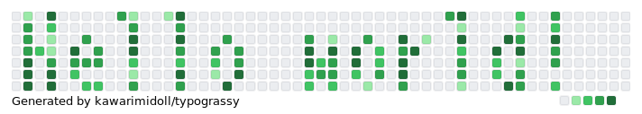</a>

##  Deno practices

### Repositories

<a href="https://github.com/kawarimidoll/deno-github-contributions-api"></a>
<a href="https://github.com/kawarimidoll/deno-dex"></a>
<a href="https://github.com/kawarimidoll/deno-diplodocus"></a>
<a href="https://github.com/kawarimidoll/denote"></a>
<a href="https://github.com/kawarimidoll/pax.deno.dev"></a>

<a href="https://github.com/kawarimidoll/deno-twemoji-convert"></a>
<a href="https://github.com/kawarimidoll/typograssy"></a>
<a href="https://github.com/kawarimidoll/deno-tl-log"></a>
<a href="https://github.com/kawarimidoll/deno-dev-template"></a>
<a href="https://github.com/kawarimidoll/deno-textdb"></a>
<a href="https://github.com/kawarimidoll/deno-cli-tools"></a>

### Gists

<ul>
<li><a href="https://gist.github.com/kawarimidoll/2f43533e5fbe319f4bc9bb255c73a02d">Auto Update Deno Dependencies</a></li>
<li><a href="https://gist.github.com/kawarimidoll/92179f60dfc67de3b0a52c5eb25ad333">Get DENO_DIR</a></li>
<li><a href="https://gist.github.com/kawarimidoll/8db8bf8a23b06f77dd0cf8fbf3315bcb">Auto Run Deno in Neovim</a></li>
</ul>

## 📝 Article

<!-- zenn-article-link-next-line -->
<a href="https://zenn.dev/vim_jp/articles/b15bbd5b682cd8">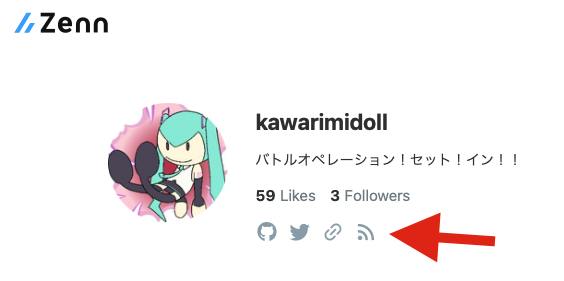</a>

## 🌟 Misc

Contents generated by GitHub profile helpers

🔥 Streak

<a href="https://github.com/DenverCoder1/github-readme-streak-stats"></a>

🏆 Trophies

<a href="https://github.com/ryo-ma/github-profile-trophy"></a>

📊 Stats

<a href="https://github.com/anuraghazra/github-readme-stats"></a>
<a href="https://github.com/anuraghazra/github-readme-stats"></a>

<a href="https://github.com/LordDashMe/github-contribution-stats/"></a>

🗂 generated profiles

<ul>
<li><a href="https://gitstalk.netlify.app/kawarimidoll">GitStalk</a></li>
<li><a href="https://gitfolio-online.vercel.app/u/kawarimidoll">GitFolio</a></li>
<li><a href="https://profile-summary-for-github.com/user/kawarimidoll">profile-summary-for-github</a></li>
</ul>

