<!--
**kawarimidoll/kawarimidoll** is a ✨ _special_ ✨ repository because its `README.md` (this file) appears on your GitHub profile.

Here are some ideas to get you started:

- 🔭 I’m currently working on ...
- 🌱 I’m currently learning ...
- 👯 I’m looking to collaborate on ...
- 🤔 I’m looking for help with ...
- 💬 Ask me about ...
- 📫 How to reach me: ...
- 😄 Pronouns: ...
- ⚡ Fun fact: ...
-->

## 🦕 Deno practices

### Repositories

### Gists

- [Auto Update Deno Dependencies](https://gist.github.com/kawarimidoll/2f43533e5fbe319f4bc9bb255c73a02d)
- [Get DENO_DIR](https://gist.github.com/kawarimidoll/92179f60dfc67de3b0a52c5eb25ad333)
- [Auto Run Deno in Neovim](https://gist.github.com/kawarimidoll/8db8bf8a23b06f77dd0cf8fbf3315bcb)

## 📝 Vim practices

### Repositories

- [tuskk.vim](https://github.com/kawarimidoll/tuskk.vim)
- [autoplay.vim](https://github.com/kawarimidoll/autoplay.vim)
- [textra.vim](https://github.com/kawarimidoll/textra.vim)
- [magic.vim](https://github.com/kawarimidoll/magic.vim)

## 📝 Article

<!-- zenn-article-link-next-line -->

You can find other articles here (in Japanese).

- [Zenn](https://zenn.dev/kawarimidoll)
- [しずかなインターネット](https://sizu.me/kawarimidoll)

## 🌟 Misc

Contents generated by GitHub profile helpers

### 🔥 Streak

### 🏆 Trophies

### 📊 Stats

### 🗂 generated profiles

- [GitStalk](https://gitstalk.netlify.app/kawarimidoll)
- [GitFolio](https://gitfolio-online.vercel.app/u/kawarimidoll)
- [profile-summary-for-github](https://profile-summary-for-github.com/user/kawarimidoll)

